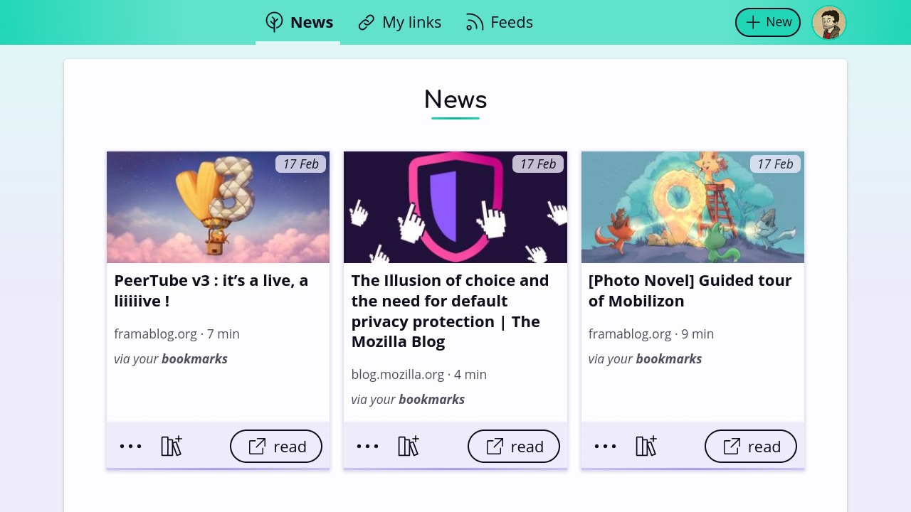

<!--
N.B.: This README was automatically generated by <https://github.com/YunoHost/apps/tree/master/tools/readme_generator>
It shall NOT be edited by hand.
-->

# Flus for YunoHost

[](https://ci-apps.yunohost.org/ci/apps/flus/)  

[](https://install-app.yunohost.org/?app=flus)

*[Read this README in other languages.](./ALL_README.md)*

> *This package allows you to install Flus quickly and simply on a YunoHost server.*  
> *If you don't have YunoHost, please consult [the guide](https://yunohost.org/install) to learn how to install it.*

## Overview

Flus brings together news feed aggregation and social bookmarking in a modern way. It is designed as a simple, yet complete tool for organising the links you gather around the Web. It comes with four main features:
### Features

- the feeds aggregation (RSS and Atom) to follow any website, podcast or video channel in one place;
- the bookmarks and collections to save your favourites articles for later and to organise them;
- the news to keep control over your newsfeed;
- the profile to share links with others.


**Shipped version:** 1.1.0~ynh1

**Demo:** <https://demo.flus.fr/>

## Screenshots



## Documentation and resources

- Official app website: <https://flus.fr/>
- Official user documentation: <https://yunohost.org/apps>
- Official admin documentation: <https://yunohost.org/packaging_apps>
- Upstream app code repository: <https://github.com/flusio/Flus>
- YunoHost Store: <https://apps.yunohost.org/app/flus>
- Report a bug: <https://github.com/YunoHost-Apps/flus_ynh/issues>

## Developer info

Please send your pull request to the [`testing` branch](https://github.com/YunoHost-Apps/flus_ynh/tree/testing).

To try the `testing` branch, please proceed like that:

```bash
sudo yunohost app install https://github.com/YunoHost-Apps/flus_ynh/tree/testing --debug
or
sudo yunohost app upgrade flus -u https://github.com/YunoHost-Apps/flus_ynh/tree/testing --debug
```

**More info regarding app packaging:** <https://yunohost.org/packaging_apps>
