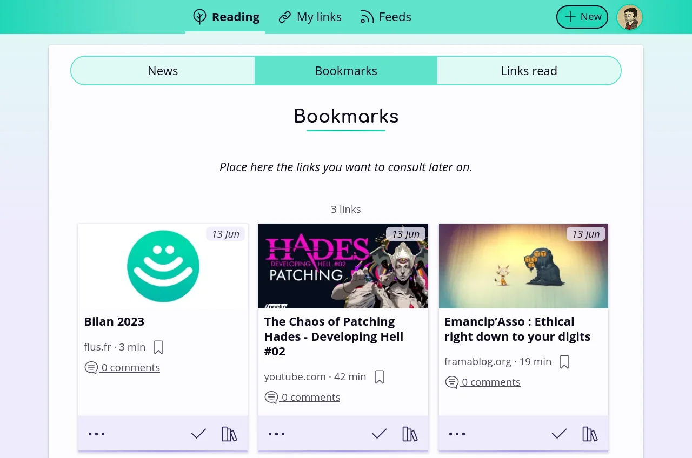

<!--
Nota bene : ce README est automatiquement généré par <https://github.com/YunoHost/apps/tree/master/tools/readme_generator>
Il NE doit PAS être modifié à la main.
-->

# Flus pour YunoHost

[](https://ci-apps.yunohost.org/ci/apps/flus/)  

[](https://install-app.yunohost.org/?app=flus)

*[Lire le README dans d'autres langues.](./ALL_README.md)*

> *Ce package vous permet d’installer Flus rapidement et simplement sur un serveur YunoHost.*  
> *Si vous n’avez pas YunoHost, consultez [ce guide](https://yunohost.org/install) pour savoir comment l’installer et en profiter.*

## Vue d’ensemble

Flus brings together news feed aggregation and social bookmarking in a modern way. It is designed as a simple, yet complete tool for organising the links you gather around the Web. It comes with four main features:
### Features

- the feeds aggregation (RSS and Atom) to follow any website, podcast or video channel in one place;
- the bookmarks and collections to save your favourites articles for later and to organise them;
- the news to keep control over your newsfeed;
- the profile to share links with others.


**Version incluse :** 1.1.0~ynh1

**Démo :** <https://demo.flus.fr/>

## Captures d’écran



## Documentations et ressources

- Site officiel de l’app : <https://flus.fr/>
- Documentation officielle de l’admin : <https://yunohost.org/packaging_apps>
- Dépôt de code officiel de l’app : <https://github.com/flusio/Flus>
- YunoHost Store : <https://apps.yunohost.org/app/flus>
- Signaler un bug : <https://github.com/YunoHost-Apps/flus_ynh/issues>

## Informations pour les développeurs

Merci de faire vos pull request sur la [branche `testing`](https://github.com/YunoHost-Apps/flus_ynh/tree/testing).

Pour essayer la branche `testing`, procédez comme suit :

```bash
sudo yunohost app install https://github.com/YunoHost-Apps/flus_ynh/tree/testing --debug
ou
sudo yunohost app upgrade flus -u https://github.com/YunoHost-Apps/flus_ynh/tree/testing --debug
```

**Plus d’infos sur le packaging d’applications :** <https://yunohost.org/packaging_apps>
