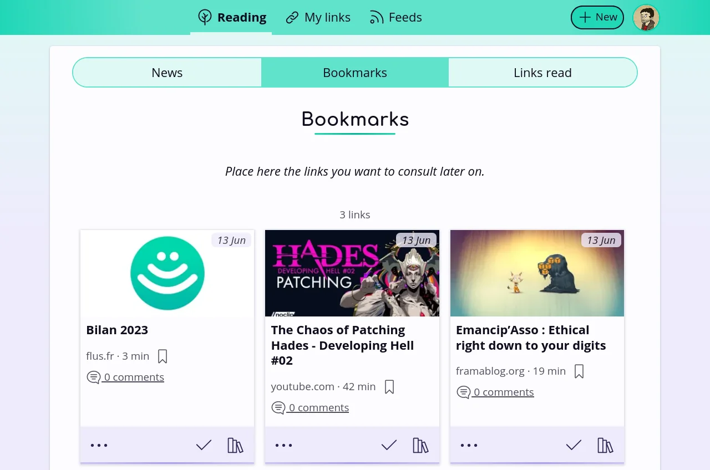

<!--
N.B.: README ini dibuat secara otomatis oleh <https://github.com/YunoHost/apps/tree/master/tools/readme_generator>
Ini TIDAK boleh diedit dengan tangan.
-->

# Flus untuk YunoHost

[](https://ci-apps.yunohost.org/ci/apps/flus/)


[](https://install-app.yunohost.org/?app=flus)

*[Baca README ini dengan bahasa yang lain.](./ALL_README.md)*

> *Paket ini memperbolehkan Anda untuk memasang Flus secara cepat dan mudah pada server YunoHost.*  
> *Bila Anda tidak mempunyai YunoHost, silakan berkonsultasi dengan [panduan](https://yunohost.org/install) untuk mempelajari bagaimana untuk memasangnya.*

## Ringkasan

Flus brings together news feed aggregation and social bookmarking in a modern way. It is designed as a simple, yet complete tool for organising the links you gather around the Web. It comes with four main features:
### Features

- the feeds aggregation (RSS and Atom) to follow any website, podcast or video channel in one place;
- the bookmarks and collections to save your favourites articles for later and to organise them;
- the news to keep control over your newsfeed;
- the profile to share links with others.


**Versi terkirim:** 1.1.0~ynh1

**Demo:** <https://demo.flus.fr/>

## Tangkapan Layar



## Dokumentasi dan sumber daya

- Website aplikasi resmi: <https://flus.fr/>
- Depot kode aplikasi hulu: <https://github.com/flusio/Flus>
- Gudang YunoHost: <https://apps.yunohost.org/app/flus>
- Laporkan bug: <https://github.com/YunoHost-Apps/flus_ynh/issues>

## Info developer

Silakan kirim pull request ke [`testing` branch](https://github.com/YunoHost-Apps/flus_ynh/tree/testing).

Untuk mencoba branch `testing`, silakan dilanjutkan seperti:

```bash
sudo yunohost app install https://github.com/YunoHost-Apps/flus_ynh/tree/testing --debug
atau
sudo yunohost app upgrade flus -u https://github.com/YunoHost-Apps/flus_ynh/tree/testing --debug
```

**Info lebih lanjut mengenai pemaketan aplikasi:** <https://yunohost.org/packaging_apps>
